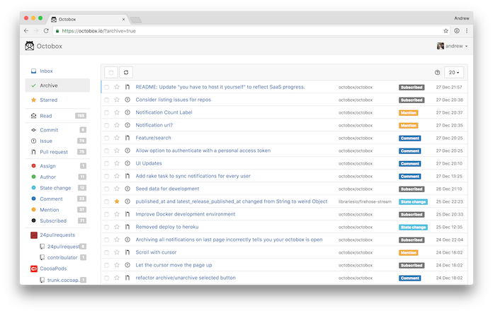

# [Octobox](https://octobox.io) &#128238; Untangle your GitHub Notifications.

Octobox helps you manage your GitHub notifications efficiently so you can spend less time managing and more time getting things done.

- **Don't lose track** - Octobox adds an extra "archived" state to each notification so you can mark it as "done". If anything happens on an archived thread, issue or PR, Octobox will move it back into your inbox.

- **Starred notifications** - Let's be honest, you probably don't have a 'favourite' issue but Octobox lets you highlight important notifications with a star so you can come back and find them easily.

- **Enhanced notifications** - Like notifications, but better. With issue/pull-request status, CI status, labels and more shown alongside basic title, organisation, repo and type information.

- **Filter all the things** - Filter notifications by repository, organisation, type, action, state, CI status and reason and keep notifications from bots alongside your regular labels, author and assignees.

- **Search with prefix filters** - No more Jedi mind tricks. Combine a wide range of powerful search filters help you get straight to the notification you're looking for and focus on just what you need.

- **Built for keyboard warriors** - Navigate, triage and manage your notifications like a pro using Gmail-inspired keyboard shortcuts for every function, no mouse required.

- **Open for everyone** - Octobox developers use Octobox to develop Octobox. 100% developed and managed in the open on GitHub under a FLOSS license.



[](https://oss.skylight.io/app/applications/eLvcBBdLmV6k)
[](https://hub.docker.com/r/octoboxio/octobox/)
[](https://gitter.im/octobox/octobox)
[](#backers)
[](#sponsors)
[](https://www.codetriage.com/andrew/github-inbox)
[](LICENSE.txt)

## Why is this a thing?

If you manage any active projects on GitHub, you probably find [GitHub Notifications](https://github.com/notifications) pretty lacking.

Notifications are marked as read and disappear from the list as soon as you load the page or view the email of the notification. This makes it very hard to keep on top of which notifications you still need to follow up on. Most open source maintainers and GitHub staff end up using a complex combination of filters and labels in Gmail to manage their notifications from their inbox. If, like me, you try to avoid email, then you might want something else.

Octobox adds an extra "archived" state to each notification so you can mark it as "done". If new activity happens on the thread/issue/pr, the next time you sync the app the relevant item will be unarchived and moved back into your inbox.

## Table of Contents

- [Octobox 📮 Untangle your GitHub Notifications.](#octobox--untangle-your-github-notifications)
	- [Why is this a thing?](#why-is-this-a-thing)
	- [Table of Contents](#table-of-contents)
	- [Getting Started](#getting-started)
		- [Install](#install)
		- [Desktop usage](#desktop-usage)
		- [Web extension](#web-extension)
	- [Requirements](#requirements)
	- [Viewing comment threads](#viewing-comment-threads)
	- [Keyboard shortcuts](#keyboard-shortcuts)
	- [API Documentation](#api-documentation)
	- [Backers](#backers)
	- [Sponsors](#sponsors)
	- [Contribute](#contribute)
		- [Note on Patches/Pull Requests](#note-on-patchespull-requests)
		- [Vulnerability disclosure](#vulnerability-disclosure)
		- [Code of Conduct](#code-of-conduct)
	- [Copyright](#copyright)

## Getting Started

### Install

You can also host Octobox yourself! See [the installation guide](docs/INSTALLATION.md)
for installation instructions and details regarding deployment to Heroku, Docker, and more.

### Desktop usage

You can run Octobox locally as a desktop app too if you'd like, using [Nativefier](https://www.npmjs.com/package/nativefier):

```bash
npm install -g nativefier
nativefier "https://octobox.io" # Or your own self-hosted URL
```

This will build a local application (.exe, .app, etc) and put it in your current folder, ready to use.

### Web extension

You can also install the cross-browser [Octobox Web Extension](https://github.com/tfrommen/octobox-web-extension). It is available for [Google Chrome](https://chromewebstore.google.com/detail/octobox/dpbajpnhgagfneijghelgldegjblinkc) and [Mozilla Firefox](https://addons.mozilla.org/en-US/firefox/addon/octobox-web-extension/), but you can also use it with other browsers that support web extensions.

## Requirements

[Web notifications](https://github.com/settings/notifications) must be enabled in your GitHub settings for Octobox to work. To receive vulnerability notifications, you must enable them as well.


## Viewing comment threads

Octobox's thread view support is currently in public beta. To enable it select 'on octobox' from the 'Open notifications' menu in `/settings`.

Threads need to be synchronised in order to view them in Octobox. Some notifications will still show the `:link-external:` icon from the notification window if they do not have an associated thread or have yet to synchronise one.

## Keyboard shortcuts

You can use keyboard shortcuts to navigate and perform certain actions:

 - `a` - Select/deselect all
 - `r` or `.` - Refresh list
 - `j` - Move down the list
 - `k` - Move up the list
 - `s` - Star current notification
 - `x` - Mark/unmark current notification
 - `y` or `e` - Archive current/marked notification(s)
 - `m` - Mute current/marked notification(s)
 - `d` - Mark current/marked notification(s) as read here and on GitHub
 - `o` or `Enter` - Open current notification in a new window

Press `?` for the help menu.

## API Documentation

Octobox provides a REST API for managing notifications, users, and pinned searches. The complete API specification is available as an OpenAPI document:

- **[OpenAPI Specification](https://github.com/octobox/octobox/blob/main/openapi.yaml)** - Complete API reference with examples
- **[Interactive API Explorer](https://petstore.swagger.io/?url=https://raw.githubusercontent.com/octobox/octobox/main/openapi.yaml)** - Try the API directly in your browser

The API supports Bearer token authentication and covers all major Octobox functionality including notification management, user settings, and pinned search operations.

## Backers
Thank you to all our backers! 🙏 [[Become a backer](https://opencollective.com/octobox#backer)]

<a href="https://opencollective.com/octobox#backers" target="_blank"></a>

## Sponsors

Support this project by becoming a sponsor. Your logo will show up here with a link to your website. [[Become a sponsor](https://opencollective.com/octobox#sponsor)]

<a href="https://opencollective.com/octobox/sponsor/0/website" target="_blank"></a>
<a href="https://opencollective.com/octobox/sponsor/1/website" target="_blank"></a>
<a href="https://opencollective.com/octobox/sponsor/2/website" target="_blank"></a>
<a href="https://opencollective.com/octobox/sponsor/3/website" target="_blank"></a>
<a href="https://opencollective.com/octobox/sponsor/4/website" target="_blank"></a>
<a href="https://opencollective.com/octobox/sponsor/5/website" target="_blank"></a>
<a href="https://opencollective.com/octobox/sponsor/6/website" target="_blank"></a>
<a href="https://opencollective.com/octobox/sponsor/7/website" target="_blank"></a>
<a href="https://opencollective.com/octobox/sponsor/8/website" target="_blank"></a>
<a href="https://opencollective.com/octobox/sponsor/9/website" target="_blank"></a>

## Testing

Run the full test suite with:

```bash
bundle exec rails test
```

### System tests (browser tests)

System tests run in a real browser using [Playwright](https://playwright.dev/) via `capybara-playwright-driver`. They test interactive behavior like keyboard shortcuts, checkbox selection, and AJAX actions.

One-time setup:

```bash
npx playwright install chromium
```

Run system tests:

```bash
bundle exec rails test:system
```

To watch tests in a visible browser window:

```bash
HEADLESS=false bundle exec rails test:system
```

## Contribute

Please do! The source code is hosted at [GitHub](https://github.com/octobox/octobox). If you want something, [open an issue](https://github.com/octobox/octobox/issues/new) or a pull request.

If you need want to contribute but don't know where to start, take a look at the issues tagged as ["Help Wanted"](https://github.com/octobox/octobox/issues?q=is%3Aopen+is%3Aissue+label%3A%22help+wanted%22).

You can also help triage issues. This can include reproducing bug reports, or asking for vital information such as version numbers or reproduction instructions. If you would like to start triaging issues, one easy way to get started is to [subscribe to Octobox on CodeTriage](https://www.codetriage.com/octobox/octobox).

Finally, this is an open source project. If you would like to become a maintainer, we will consider adding you if you contribute frequently to the project. Feel free to ask.

For other updates, follow the project on Twitter: [@octoboxio](https://twitter.com/octoboxio).

### Note on Patches/Pull Requests

 * Fork the project.
 * Make your feature addition or bug fix.
 * Add tests for it. This is important so we don't break it in a future version unintentionally.
 * Send a pull request. Bonus points for topic branches.

### Vulnerability disclosure

We support and encourage security research on Octobox under the terms of our [vulnerability disclosure policy](docs/VULNERABILITY_DISCLOSURE_POLICY.md).

### Code of Conduct

Please note that this project is released with a [Contributor Code of Conduct](docs/CODE_OF_CONDUCT.md). By participating in this project you agree to abide by its terms.

## Copyright

[GNU Affero License](LICENSE.txt) © 2021 [Andrew Nesbitt](https://github.com/andrew).
