## Installing Octobox on OpenShift Online

First of all, you need an OpenShift cluster to which you want to install Octobox.
This can be e.g. [Minishift](https://github.com/minishift/minishift) for a simple development environment or [OpenShift Online](https://www.openshift.com/pricing/index.html), the hosted offering by Red Hat.
OpenShift online has a free "Starter" tier, so you can test the installation without any extra costs.

The installation procedure is the same everywhere:

* Register a GitHub OAuth app
* Install an [OpenShift template](octobox-template.yml) to the cluster
* Instantiate the template by providing some required information like the GitHub OAuth app credentials
* Create a route so the application is accessible from the outside
* Configure the OAuth callback URL for your OAuth app in GitHub

The remaining part of this documentation describes the installation on OpenShift Online, but the description are applicable to other setups as well.

### Register GitHub OAuth app

First you need to register Octobox as an [GitHub OAuth app](https://help.github.com/articles/authorizing-oauth-apps/).
You can do this either for a GitHub organization of for an User.

To do so, go to your accounts [Developer Settings](https://github.com/settings/developers)

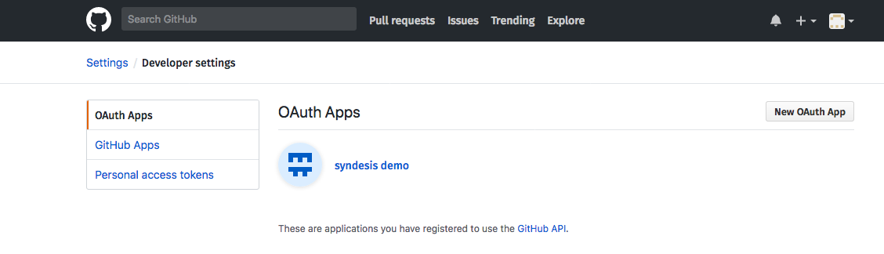

-----

Select "Oauth Apps" on the left side and press "New OAuth App" to reach the settings page:

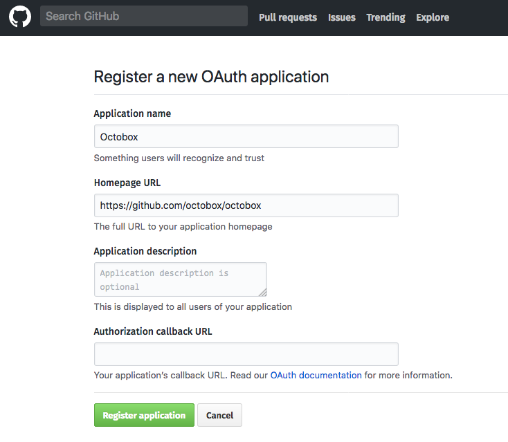

-----

Give the app a name, enter an homepage URL and then press "Register application".
On the next screen you have now access to the "Client ID" and "Client Secret".
We will this data later when instantiating the Octobox app

<a name="oauth-creds">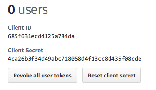</a>

-----

You don't have to fill out the "Authorization callback URL" yet.
We will do this later when we have created the OpenShift route.

### OpenShift Online Account

Go to the [OpenShift Online login form](https://manage.openshift.com/accounts/auth/keycloak) to get an OpenShift Online subscription and either login with an existing Red Hat account or create a new one. Don't worry, the Starter plan is for free and you don't need to enter any credit card details.

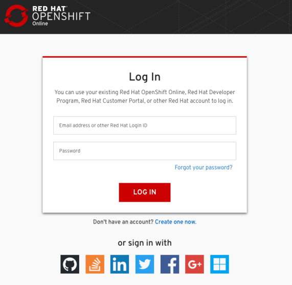

-----

After you logged in you are asked for the plan.
Choose the "Starter" plan here.

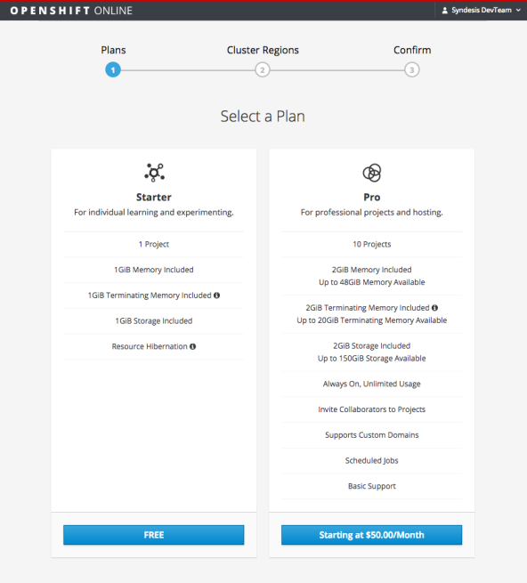

-----

Now choose the region of your preference:

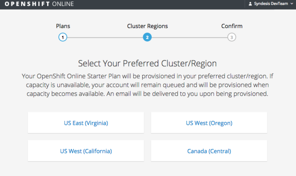

-----

On the final screen confirm you subscriptions:

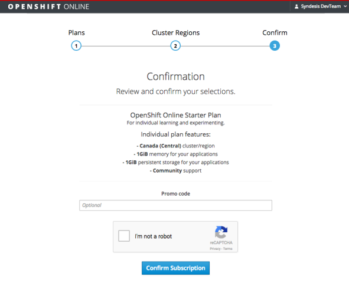

-----

Now you have to wait for some minutes.
Just reload the final confirmation screen after some minutes and you will see your subscription overview page.

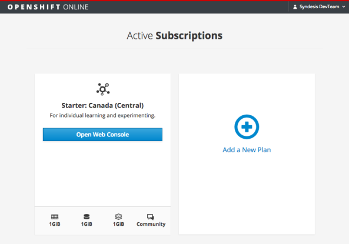

-----

Open the Web console by pressing the button to reach the OpenShift console

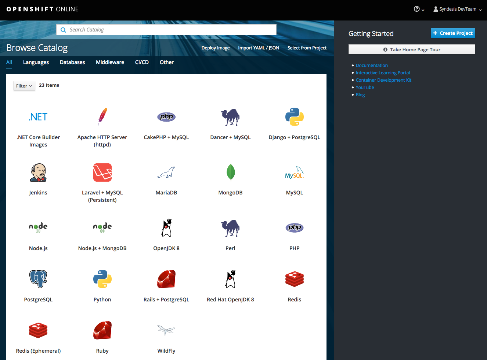

-----

### Install and process Template

Now it's time to install the template.
On the OpenShift console select "Import YAML/JSON" from the top menu

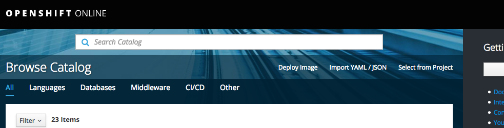

-----

Fill out a project name, display name and if you like also the description.
Then select "Browse..." and pick up the [Octobox OpenShift Template](octobox-template.yml) and upload it:

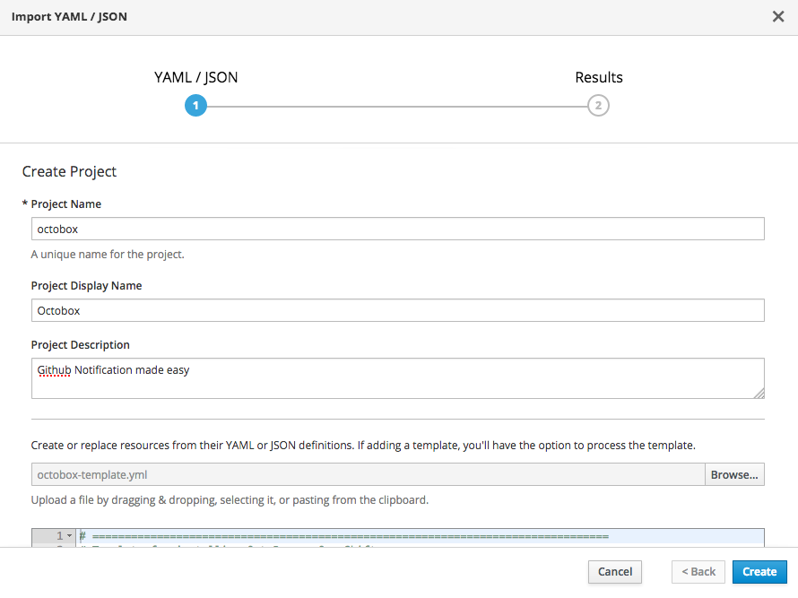

-----

It could be that the project name is already taken. Just use another name then.

Now you are able to process the template right now:

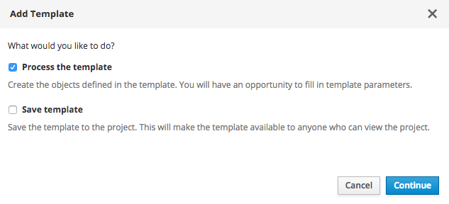

-----

Select "Process the template" and "continue".
It's now time to fill out the template parameters:

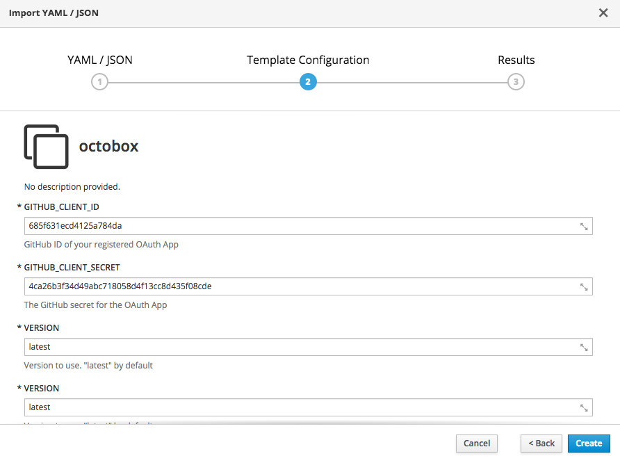

-----

The only mandatory fields to fill out here are `GITHUB_CLIENT_ID` and `GITHUB_CLIENT_SECRET`.
Choose the credentials that you have [created](#oauth-creds) when registering the GitHub OAuth App.

The other parameters should be more or less self explaining:

* `GITHUB_CLIENT_ID` and `GITHUB_CLIENT_SECRET` : GitHub OAuth creds
* `VERSION` : Docker image version to use. "latest" by default
* `MINIMUM_REFRESH_INTERVAL` the minimal refresh value to allow (5 by default). Set it to 0 to not allow automatic refreshes.
* `FETCH_SUBJECT` : Set to `true` if you want to fetch additional information like labels (experimental). It's `false` by default.
* `OPEN_IN_SAME_TAB`: Set to `true` if you want GitHub links to be opened in same tab as Octoxbox. By default links are opened in a new tab but it might be useful to reuse the existing tab when Octobox is used within integrated platform like Wavebox.
* `OCTOBOX_SIDEKIQ_SCHEDULE_ENABLED`: Set to `true` to allow background fechting of notifications. This considerably speeds up the overall performance but needs more resources. Disabled by default.
- `MEMORY_LIMIT_OCTOBOX`, `MEMORY_LIMIT_REDIS`, `MEMORY_LIMIT_POSTGRES` : Memory limit for the various application parts. Don't change this when running on the starter plan.

If everything goes well you should end up with

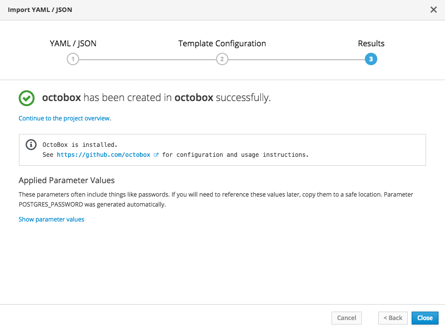

-----

### Create Route

In order to access Octobox from externally we have to create a "Route".
Go to the created OpenShift project from the main page by following the project name link ("Octobox" in this case):

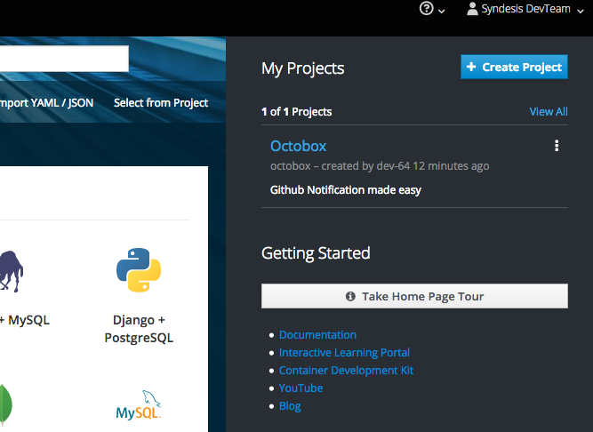

-----

On the project console, select "Applications" on the left menu, then "Routes":

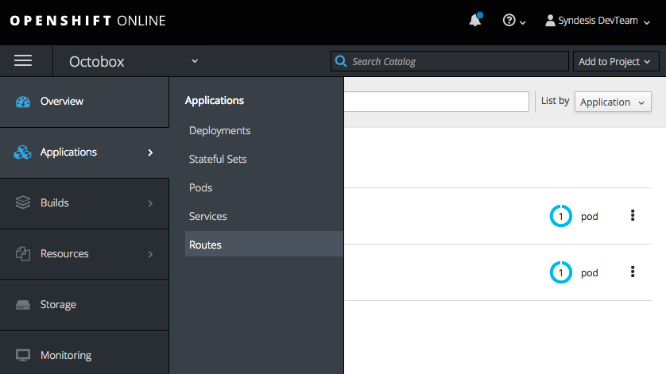

-----

Press "Create Route" here:

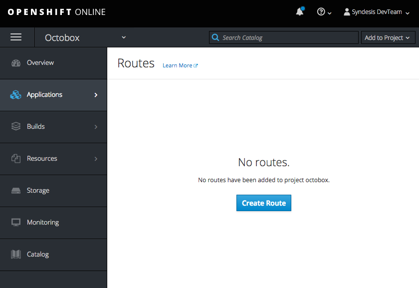

-----

Then:

* Choose a name like "app" and leave the hostname field empty.
* Select "Security" with edge termination
* Leave all other values at default values
* Press "Create"

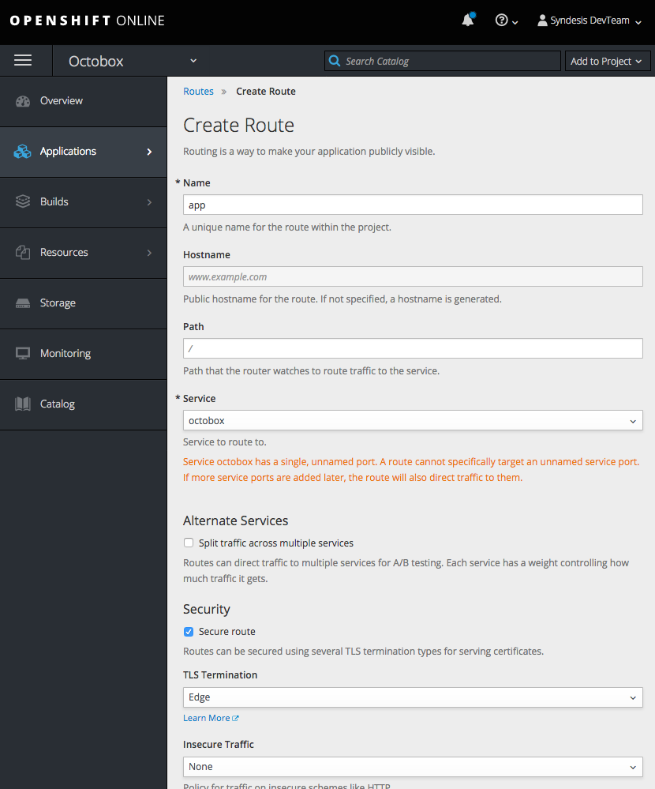

-----

On the followup screen you will see the URL with which your application can be accessed.
This is the entry URL to your Octobox instance.
Copy this URL as you need it in the final step

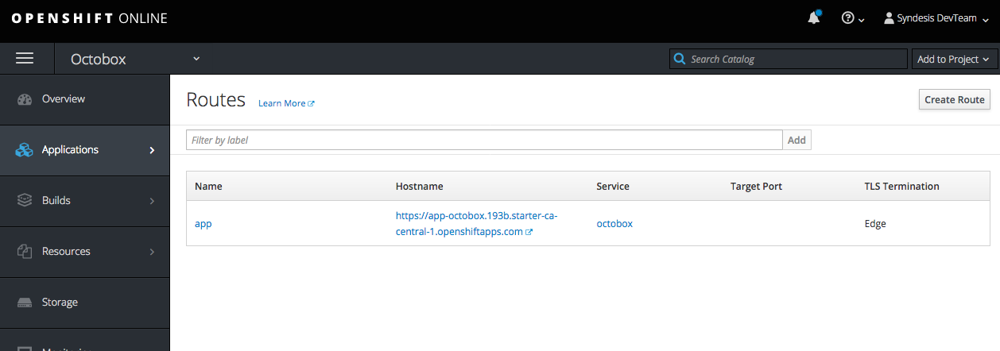

-----

### Configure Callback URL

Finally you have to configure the callback URL for your GitHub OAuth app.
Go back to GitHub, "Developer Settings" --> "OAuth Apps" --> "Octobox"

In the callback form field enter: `<route URL>/auth/github/callback` and save:

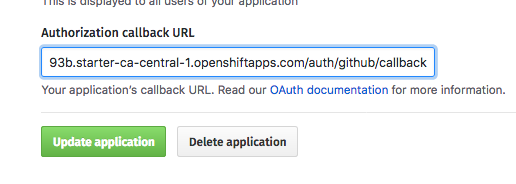

-----

Et voilà !

Go to your apps URL (`https://app-octobox.193b.starter-ca-central-1.openshiftapps.com` in this example) and enjoy your freshly installed Octobox.
